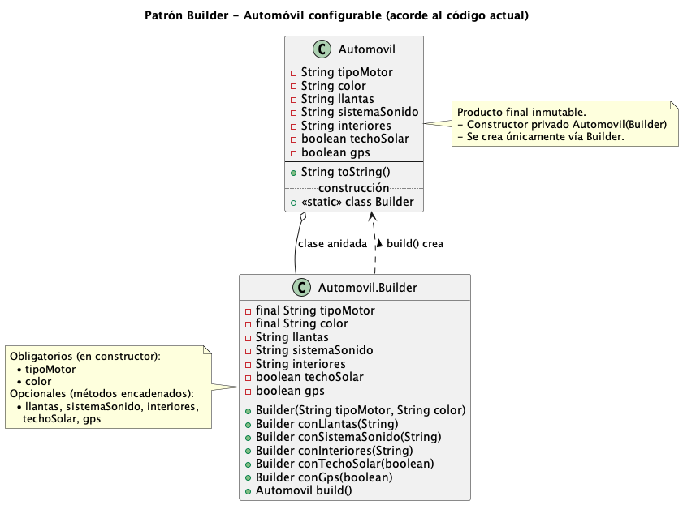

***

# Car Builder (Patrón Builder en Java)

Proyecto de ejemplo en Java que implementa el **patrón de diseño Builder** para construir objetos `Automovil` con múltiples configuraciones opcionales sin usar constructores con demasiados parámetros.

## Descripción del problema

Un objeto `Automovil` puede tener muchas opciones de configuración: tipo de motor, color, llantas, sistema de sonido, interiores, techo solar, GPS, etc.  
Si se intentan manejar todas estas opciones con constructores tradicionales, aparecen problemas como:

- Constructores con muchos parámetros difíciles de leer.  
- Múltiples constructores sobrecargados.  
- Dificultad para saber qué parámetros son obligatorios y cuáles opcionales.

## ¿Por qué uso el patrón Builder?

El patrón **Builder** permite construir objetos complejos paso a paso, separando la **lógica de construcción** del objeto final.  
En este ejercicio se usa Builder para:

- Evitar el “constructor telescópico”.  
- Hacer el código más legible al nombrar cada paso de configuración.  
- Permitir que algunos atributos sean obligatorios (por ejemplo, tipo de motor y color) y otros opcionales (llantas, sonido, techo solar, GPS).

Ejemplo de uso:

```java
Automovil auto = new Automovil.Builder("Gasolina 2.0", "Rojo")
        .conLlantas("Deportivas 18\"")
        .conSistemaSonido("Bose Premium")
        .conInteriores("Cuero negro")
        .conTechoSolar(true)
        .conGps(true)
        .build();
```

Con esta forma de construcción, el código es más claro y fácil de mantener.

## Estructura de clases

- `Automovil`: clase inmutable que representa el automóvil configurado.  
  - Tiene atributos como `tipoMotor`, `color`, `llantas`, `sistemaSonido`, `interiores`, `techoSolar`, `gps`.  
  - Su constructor es privado y solo se puede crear a través del `Builder`.

- `Automovil.Builder`: clase estática interna encargada de construir instancias de `Automovil`.  
  - Recibe en el constructor los atributos **obligatorios** (`tipoMotor`, `color`).  
  - Ofrece métodos encadenados para configurar los atributos **opcionales**:  
    - `conLlantas(String llantas)`  
    - `conSistemaSonido(String sistemaSonido)`  
    - `conInteriores(String interiores)`  
    - `conTechoSolar(boolean techoSolar)`  
    - `conGps(boolean gps)`  
  - Método final `build()` que devuelve el `Automovil` completamente construido.

## Diagrama UML

A continuación se muestra la representación visual del patrón. Se destaca el uso de la **clase anidada (Inner Class)** y el **constructor privado** para garantizar que la creación del objeto sea controlada exclusivamente por el `Builder`.



## Justificación técnica del Patrón
Se implementó el patrón **Builder** porque el escenario requiere la creación de objetos complejos (`Automovil`) con múltiples atributos opcionales. 
* **Ventaja 1:** Evita el "constructor telescópico".
* **Ventaja 2:** Garantiza la inmutabilidad del objeto final.
* **Ventaja 3:** Mejora la legibilidad del código en el cliente (`Main.java`).

## Requisitos

- Java 21 (o compatible).  
- Maven.  

## Cómo ejecutar

1. Clonar el repositorio o abrir el proyecto en tu IDE.  
2. Ejecutar la clase `Main` (por ejemplo, `com.andresgt.builder.Main`) que crea un automóvil usando el `Builder` y lo muestra por consola.

Ejemplo de salida:

```text
Automovil{tipoMotor='Gasolina 2.0', color='Rojo', llantas='Deportivas 18"', sistemaSonido='Bose Premium', interiores='Cuero negro', techoSolar=true, gps=true}
```

***
